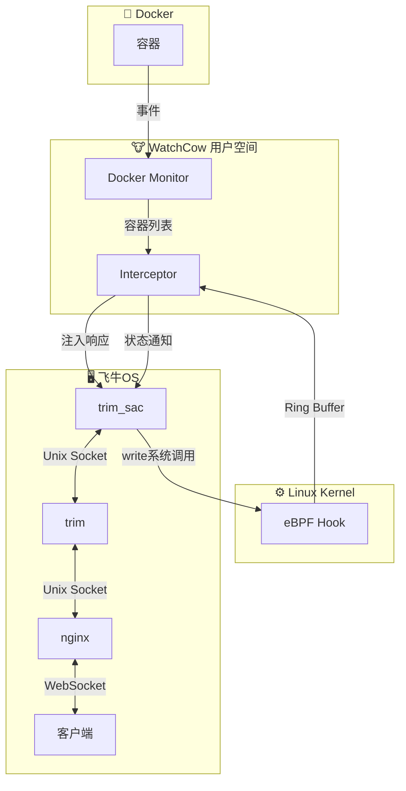

# WatchCow 🐮

**飞牛OS (fnOS) 的 Docker 桌面图标增强项目**

WatchCow 是一个针对飞牛OS设计的轻量级Docker容器管理增强工具，通过 eBPF 技术自动将 Docker 容器注册到飞牛OS的应用商店，让容器像原生应用一样显示在桌面上。

## ✨ 功能特性

- 🔍 **自动发现** - 自动检测运行中的 Docker 容器
- 🏷️ **灵活配置** - 通过 Docker labels 自定义应用信息（名称、图标、分类等）
- 🔔 **实时通知** - 容器启动/停止时实时通知飞牛OS客户端
- 🚀 **无副作用** - 运行时内存注入，停止后系统完全恢复原状
- ⚡ **高性能** - 基于 eBPF 的内核级拦截，性能开销极小
- 🎨 **美观展示** - 支持自定义图标、分类、描述等显示信息

## 🏗️ 技术方案

### 核心技术栈

- **Go 1.25** - 主要开发语言
- **Cilium eBPF** - 使用 cilium/ebpf 库实现内核级系统调用拦截
- **Docker Engine API** - 容器监控和事件处理
- **WebSocket** - 与飞牛OS通信协议
- **Linux Kernel 5.8+** - eBPF 特性支持

### 工作原理



#### 实现细节

1. **eBPF 拦截**
   - 使用 eBPF 程序附加到 `sys_enter_write` tracepoint
   - 过滤 `trim_sac` 进程的 write() 系统调用
   - 捕获 WebSocket 通信数据并通过 ring buffer 传递到用户空间

2. **WebSocket 消息处理**
   - 识别 `appStoreList` 请求的响应（包含应用列表）
   - 解析 JSON 数据结构
   - 注入 Docker 容器信息到应用列表
   - 使用 `pidfd_getfd()` 复制 socket FD 发送修改后的响应

3. **Docker 容器监控**
   - 通过 Docker Engine API 监听容器事件
   - 支持自动发现（扫描暴露端口）和标签配置两种模式
   - 实时推送容器状态变化通知

4. **进程发现与通知**
   - 通过 `pid: host` 访问宿主机进程，定位 `trim_sac` 进程（通知发起者）
   - 扫描 `trim_sac` 的 Unix socket，找到连接到 `trim`（通知中心）的 socket
   - 通过 socket 向 `trim` 发送通知，由 `trim` 转发到客户端

## 📦 快速开始

### 前置要求

- **飞牛OS** 系统（专为飞牛OS设计）
- **Docker** 和 **Docker Compose**

### 安装步骤

1. **克隆项目**

```bash
git clone https://github.com/tf4fun/watchcow.git
cd watchcow
```

2. **启动 WatchCow**

```bash
docker-compose up -d
```

3. **查看日志**

```bash
docker logs -f watchcow
```

你应该看到类似输出：
```
🚀 WatchCow - Docker Injector for fnOS
========================================
✅ eBPF programs loaded successfully
✅ Monitoring started (Press Ctrl+C to stop)
🐳 Starting Docker monitor...
```

4. **测试示例应用**

```bash
cd examples/nginx
docker-compose up -d
```

WatchCow 会自动检测到新容器并注入到飞牛OS应用列表中。

### 调试模式

启用调试模式查看详细的包拦截信息：

```bash
docker-compose run watchcow --debug
```

## 📁 项目结构

```
watchcow/
├── bpf/                      # eBPF C 代码
│   ├── unix_hook.c          # write() 系统调用 hook
│   └── common.h             # eBPF 公共定义
│
├── cmd/
│   └── watchcow/
│       └── main.go          # 程序入口
│
├── internal/
│   ├── ebpf/                # eBPF 加载器
│   │   └── loader.go        # 加载 eBPF 程序、处理 ring buffer
│   │
│   ├── interceptor/         # 核心拦截逻辑
│   │   ├── interceptor.go   # 主拦截器（事件处理、响应注入）
│   │   ├── processor.go     # 数据处理（JSON 解析、Docker 应用注入）
│   │   ├── notifier.go      # 通知发送（WebSocket 消息构建）
│   │   ├── pidfd.go         # PID 文件描述符管理
│   │   ├── sockdiag.go      # Socket 诊断（netlink SOCK_DIAG）
│   │   └── websocket.go     # WebSocket 协议处理
│   │
│   └── docker/              # Docker 监控
│       └── monitor.go       # 容器事件监听、AppInfo 转换
│
├── examples/                # 示例应用配置
│   ├── nginx/              # Nginx 示例
│   └── README.md           # 示例使用说明
│
├── Dockerfile              # WatchCow 镜像构建
├── docker-compose.yml      # 部署配置
├── go.mod                  # Go 模块依赖
├── CLAUDE.md              # Claude Code 开发指南
└── README.md              # 本文件
```

### 关键文件说明

- **`bpf/unix_hook.c`** - eBPF 程序，附加到内核 tracepoint 拦截 write() 调用
- **`internal/ebpf/loader.go`** - 使用 `cilium/ebpf` 库加载 eBPF 程序
- **`internal/interceptor/interceptor.go`** - 事件处理管道，检测和修改 WebSocket 消息
- **`internal/docker/monitor.go`** - Docker 事件监听器，实时追踪容器状态

## 🔧 构建方式

```bash
# 构建镜像
docker-compose build

# 或使用自定义镜像名
docker build -t watchcow:latest .
```

## ⚙️ 配置说明

### Docker Compose 配置

WatchCow 需要以下特殊权限和挂载：

```yaml
services:
  watchcow:
    privileged: true           # eBPF 需要特权模式（已包含所有必要权限）
    network_mode: host         # 访问宿主机网络和 Unix socket
    pid: host                  # 查看所有进程（包括 trim_sac）

    volumes:
      - /sys/kernel/debug:/sys/kernel/debug:ro        # Tracepoint 访问
      - /var/run/docker.sock:/var/run/docker.sock:rw  # Docker API
```

### 容器标签配置

在你的 `docker-compose.yml` 中添加 WatchCow 标签：

```yaml
services:
  myapp:
    image: nginx:latest
    ports:
      - "8080:80"

    labels:
      # 必需标签
      watchcow.enable: "true"              # 启用 WatchCow 发现
      watchcow.appName: "my-nginx"         # 应用唯一标识
      watchcow.title: "我的 Nginx"          # 显示名称
      watchcow.port: "8080"                # 外部访问端口
      watchcow.fnDomain: "my-nginx"        # fnOS 域名

      # 可选标签
      watchcow.desc: "Web 服务器"           # 应用描述
      watchcow.icon: "https://example.com/icon.png"  # 图标 URL
      watchcow.category: "网络服务"         # 分类
      watchcow.protocol: "http"            # 协议（http/https）
      watchcow.host: ""                    # 主机地址（默认为空，使用本地）
      watchcow.path: "/"                   # URL 路径
```

### 支持的标签列表

| 标签 | 必需 | 默认值 | 说明 |
|------|------|--------|------|
| `watchcow.enable` | ✅ | - | 是否启用（"true"） |
| `watchcow.appName` | ✅ | - | 应用唯一标识 |
| `watchcow.title` | ✅ | - | 显示标题 |
| `watchcow.port` | ✅ | - | 外部端口 |
| `watchcow.fnDomain` | ✅ | - | fnOS 域名 |
| `watchcow.appID` | ❌ | 容器ID | 应用 ID |
| `watchcow.entryName` | ❌ | = appName | Entry 名称 |
| `watchcow.desc` | ❌ | - | 描述信息 |
| `watchcow.icon` | ❌ | Docker 图标 | 图标 URL |
| `watchcow.category` | ❌ | "Docker" | 分类 |
| `watchcow.protocol` | ❌ | "http" | 协议 |
| `watchcow.host` | ❌ | "" | 主机地址（用于外部链接） |
| `watchcow.path` | ❌ | "/" | URL 路径 |
| `watchcow.microApp` | ❌ | "false" | 是否为微应用 |
| `watchcow.nativeApp` | ❌ | "false" | 是否为原生应用 |
| `watchcow.isDisplay` | ❌ | "true" | 是否显示 |

## 📚 示例应用

项目包含多个示例应用配置，位于 `examples/` 目录：

### Nginx 示例

```bash
cd examples/nginx
docker-compose up -d
```

查看完整的配置说明和更多示例：

```bash
cat examples/README.md
```

### 创建自己的应用

1. 复制示例作为模板：
```bash
cp -r examples/nginx examples/myapp
```

2. 修改 `compose.yaml` 中的标签
3. 启动容器：
```bash
cd examples/myapp
docker-compose up -d
```

## 🐛 故障排查

### 容器未被发现

**检查 WatchCow 是否运行**
```bash
docker ps | grep watchcow
docker logs watchcow
```

**检查容器标签**
```bash
docker inspect your-container | grep watchcow
```

**确认标签格式**
- `watchcow.enable` 必须是字符串 `"true"`
- 标签值不能为空
- 端口号必须是字符串

### eBPF 加载失败

**检查内核版本**
```bash
uname -r  # 应该 >= 5.8
```

**检查内核配置**
```bash
# 检查 BPF 支持
cat /proc/config.gz | gunzip | grep CONFIG_BPF

# 检查 tracepoint 支持
ls /sys/kernel/debug/tracing/events/syscalls/
```

**检查权限**
- 确保容器以 `privileged: true` 运行
- 确保挂载了 `/sys/kernel/debug`

### 通知未发送

**检查 trim_sac 进程**
```bash
ps aux | grep trim_sac
```

**启用调试模式**
```bash
docker-compose run watchcow --debug
```

调试模式会显示：
- 所有拦截的数据包（hex dump）
- Socket FD 扫描详情
- 通知发送过程

### 应用显示不正确

**修改标签后重启容器**
```bash
docker-compose restart
```

**检查 WatchCow 日志**
```bash
docker logs watchcow | grep "Updated Docker app list"
```

## 🔬 开发指南

### 修改 eBPF 代码

1. 编辑 `bpf/unix_hook.c`
2. 重新生成绑定：
```bash
cd internal/ebpf
go generate
```
3. 重新构建：
```bash
docker-compose build
```

### 调试技巧

**查看 eBPF 程序状态**
```bash
# 列出加载的 eBPF 程序
bpftool prog list | grep watchcow

# 查看 eBPF maps
bpftool map list

# 查看 ring buffer 统计
bpftool map dump name events
```

**使用 strace 追踪系统调用**
```bash
# 追踪 trim_sac 的 write() 调用
strace -p $(pidof trim_sac) -e write -s 1000
```

**测试 WebSocket 消息**
使用调试模式捕获实际的 WebSocket 消息格式：
```bash
docker-compose run watchcow --debug 2>&1 | tee debug.log
```

## 📄 许可证

MIT License - 查看 [LICENSE](LICENSE) 文件了解详情

## 🙏 致谢

- [Cilium eBPF](https://github.com/cilium/ebpf) - Go eBPF 库
- [Docker](https://www.docker.com/) - 容器运行时
- [飞牛OS](https://www.fnnas.com/) - 目标平台
- [Dashboard Icons](https://github.com/homarr-labs/dashboard-icons) - 应用图标资源

## 📮 联系方式

- **Issues**: [GitHub Issues](https://github.com/tf4fun/watchcow/issues)
- **讨论**: [GitHub Discussions](https://github.com/tf4fun/watchcow/discussions)

## ⚠️ 重要说明

### 功能限制

**⚠️ 暂不支持 FN Connect 集成**

WatchCow 目前仅在内网环境下工作，注册的 Docker 容器应用**无法通过 FN Connect 在外网访问**。这是因为：

- WatchCow 注入的应用信息仅存在于飞牛OS本地进程内存中
- FN Connect 云端服务无法获取这些动态注入的应用数据
- 外网访问需要应用在飞牛OS应用商店中正式注册

### 支持本项目

如果你喜欢这个方案，希望飞牛OS官方能够集成类似功能，欢迎前往官方论坛跟帖支持：

🔗 **[飞牛OS论坛 - Docker 桌面图标支持讨论帖](https://club.fnnas.com/forum.php?mod=viewthread&tid=39477)**

你的支持可能会推动官方将此功能集成到未来的飞牛OS版本中！

---

**⭐ 如果这个项目对你有帮助，请给个 Star！**
